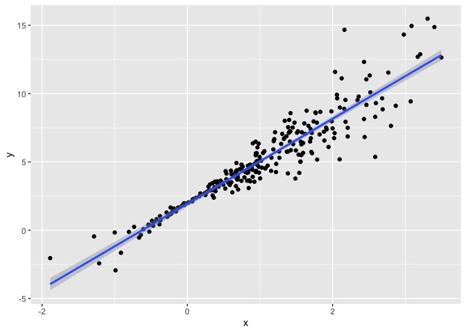

Bootstrapping
================
Laura Robles-Torres
2023-11-30

Bootstrapping is a popular resampling-based approach to statistical
inference, and is helpful when usual statistical methods are intractable
or inappropriate. The idea is to draw repeated samples from your
original sample with replacement, thereby approximating the repeated
sampling framework. Using list columns to store bootstrap samples is
natural and provides a “tidy” approach to resampling-based inference.

------------------------------------------------------------------------

# Repeated sampling

## Why?

Repeated sampling is a conceptual framework that underlies most of
statistics. If you want to know something about true pop. mean, you will
draw a sample and compute a sample mean. If you understand what would
happen with MULTIPLE same size samples from a population, you can say
something about the distribution of your mean in your sample. The sample
mean and dist. of it can be used to create a CI and make statements on
what approximates the truth. The distribution of the sample mean
converges to a normal distribution.

Traditionally, the distribution of a sample statistic (sample mean, SLR
coefficients, etc.) for repeated, random draws from a population has
been established theoretically. These theoretical distributions make
some assumptions about the underlying population from which samples are
drawn, or depend on large sample sizes for asymptotic results. Normal
distribution is known/assumed in those settings.

In cases where the *assumptions aren’t met*, or *sample sizes aren’t
large enough* for asymptotics to kick in, it is still necessary to make
inferences using the sample statistic. In these cases, drawing
repeatedly from the original population would be great – one could
simple draw a lot of samples and look at the empirical (rather than
theoretical) distribution. But, as we said in iteration and simulation,
repeated sampling just doesn’t happen in the real world.

I don’t know what distribution this follows but Im gonna repeat a sample
a bunch of times and look at the distribution of what I’m interested to
see what the confidence intervals, range, distribution of my data is.

## What is it?

The idea is to mimic repeated sampling with the one sample you have.
Your sample is drawn at random from your population. A *bootstrap
sample* is drawn from the one sample you do have. It has: - the same
size as the original sample - is drawn with replacement. (You draw a
person ID 4 into your bootstrap sample, and it can then go back into the
original population and could be drawn again)

You analyze this sample using whatever approach you want to apply and
repeat.

## How?

Coding the bootstrap uses a function to: - draw a sample with
replacement - analyze the sample - return object of interest and repeat
this many times.

We use list columns to keep track of the bootstrap samples, analyses and
results in a single df.

------------------------------------------------------------------------

## Simulate data:

First I’ll generate ‘x’, then an ‘error’ sampled from a normal
distribution, and then a response ‘y’; this all gets stored in dataframe
‘sim_df_const’. Then I’ll modify this by multiplying the errors by a
term that involves x, and create a new response variable y.

``` r
n_samp = 250

sim_df_const = 
  tibble(
    x = rnorm(n_samp, 1, 1),
    error = rnorm(n_samp, 0, 1),
    y = 2 + 3 * x + error
  )


#this second df has the same x values n takes error terms and multiplies them and generates y.

sim_df_nonconst = 
  sim_df_const |> 
  mutate(
  error = error * .75 * x,
  y = 2 + 3 * x + error
)
```

Plot to see it. Residuals have constant variance across x axis in this
linear regression (first plot). In second plot, when x is close to 0,
the error is pretty small. but when x is far from zero, the residuals
spread out more further from the line. we would not be able to meet the
assumption that the variance of the residuals is constant in a linear
regression so we wouldnt be able to do the lm model as we do. you could
still fit and get estimates, but the problem comes from trying to guess
confidence intervals and uncertainty in your model.

``` r
sim_df_const |>
  ggplot(aes(x=x, y=y))+geom_point()+geom_smooth(method="lm")
```

    ## `geom_smooth()` using formula = 'y ~ x'

<!-- -->

``` r
sim_df_nonconst |>
  ggplot(aes(x=x, y=y))+geom_point()+geom_smooth(method="lm")
```

    ## `geom_smooth()` using formula = 'y ~ x'

<!-- -->

``` r
lm(y~x, data=sim_df_const) |> broom::tidy()
```

    ## # A tibble: 2 × 5
    ##   term        estimate std.error statistic   p.value
    ##   <chr>          <dbl>     <dbl>     <dbl>     <dbl>
    ## 1 (Intercept)     1.98    0.0981      20.2 3.65e- 54
    ## 2 x               3.04    0.0699      43.5 3.84e-118

``` r
lm(y~x, data=sim_df_nonconst) |> broom::tidy()
```

    ## # A tibble: 2 × 5
    ##   term        estimate std.error statistic   p.value
    ##   <chr>          <dbl>     <dbl>     <dbl>     <dbl>
    ## 1 (Intercept)     1.93    0.105       18.5 1.88e- 48
    ## 2 x               3.11    0.0747      41.7 5.76e-114

You can get estimates and CI based on usual assumptions and you can get
results as if those assumptions are true. We don’t really see that
standard error is higher for the second dataset, even though we should.
Despite the very different error structures, standard errors for
coefficient estimates are similar in both cases!

We’ll use the bootstrap to make inference for the data on the right.
This is intended largely as an illustration for how to use the bootstrap
in cases where the theoretical distribution is “unknown”, although for
these data in particular weighted least squares could be more
appropriate.

I know assumptions aren’t met here…I need to understand what the dist.
of my slope and intercept are under repeated sampling using bootstrap.

# Drawing one bootstrap sample

### Function to generate bootstrap samples

- Argument is the dataframe
- Return object is a sample from that df drawn with replacement

``` r
boot_sample = function(df) {
  
  sample_frac(df, replace = TRUE) |>
    arrange(x)
}

#sample_frac draws a sample of a particular proportion of your dataset. we want it to be the same size as the df, so we saw "(df" and we say replace=true so that its with replacement.  
```

### Check if it works

``` r
#applies function to dataset
boot_sample(sim_df_nonconst)
```

    ## # A tibble: 250 × 3
    ##         x  error       y
    ##     <dbl>  <dbl>   <dbl>
    ##  1 -1.89   1.62  -2.04  
    ##  2 -1.29   1.40  -0.454 
    ##  3 -0.989 -1.97  -2.93  
    ##  4 -0.989 -1.97  -2.93  
    ##  5 -0.914 -0.908 -1.65  
    ##  6 -0.914 -0.908 -1.65  
    ##  7 -0.914 -0.908 -1.65  
    ##  8 -0.733  0.447  0.248 
    ##  9 -0.733  0.447  0.248 
    ## 10 -0.606 -0.106  0.0774
    ## # ℹ 240 more rows

``` r
boot_sample(sim_df_nonconst) |> 
  ggplot(aes(x = x, y = y)) + 
  geom_point(alpha = .3) +
  stat_smooth(method = "lm")
```

    ## `geom_smooth()` using formula = 'y ~ x'

<!-- -->

(Darker obs means the same obs is seen multiple times)

That looks about right. In comparison with the original data, the
bootstrap sample has the same characteristics but isn’t a perfect
duplicate – some original data points appear more than once, others
don’t appear at all.

# Drawing many bootstrap samples

This will create a list column to keep track of every repeated sample
with replacement.

``` r
boot_straps = 
  tibble(
    strap_number = 1:1000, 
    strap_sample = rerun(1000, boot_sample(df = sim_df_nonconst))
  )
```

    ## Warning: `rerun()` was deprecated in purrr 1.0.0.
    ## ℹ Please use `map()` instead.
    ##   # Previously
    ##   rerun(1000, boot_sample(df = sim_df_nonconst))
    ## 
    ##   # Now
    ##   map(1:1000, ~ boot_sample(df = sim_df_nonconst))
    ## This warning is displayed once every 8 hours.
    ## Call `lifecycle::last_lifecycle_warnings()` to see where this warning was
    ## generated.

``` r
boot_straps
```

    ## # A tibble: 1,000 × 2
    ##    strap_number strap_sample      
    ##           <int> <list>            
    ##  1            1 <tibble [250 × 3]>
    ##  2            2 <tibble [250 × 3]>
    ##  3            3 <tibble [250 × 3]>
    ##  4            4 <tibble [250 × 3]>
    ##  5            5 <tibble [250 × 3]>
    ##  6            6 <tibble [250 × 3]>
    ##  7            7 <tibble [250 × 3]>
    ##  8            8 <tibble [250 × 3]>
    ##  9            9 <tibble [250 × 3]>
    ## 10           10 <tibble [250 × 3]>
    ## # ℹ 990 more rows

Checking if it worked by looking at a couple

``` r
boot_straps |> 
  slice(1:3) |> 
  mutate(strap_sample = map(strap_sample, arrange, x)) |> 
  pull(strap_sample)
```

    ## [[1]]
    ## # A tibble: 250 × 3
    ##         x  error       y
    ##     <dbl>  <dbl>   <dbl>
    ##  1 -1.29   1.40  -0.454 
    ##  2 -0.989 -1.97  -2.93  
    ##  3 -0.914 -0.908 -1.65  
    ##  4 -0.914 -0.908 -1.65  
    ##  5 -0.805  0.292 -0.123 
    ##  6 -0.805  0.292 -0.123 
    ##  7 -0.665 -0.544 -0.539 
    ##  8 -0.641 -0.416 -0.338 
    ##  9 -0.606 -0.106  0.0774
    ## 10 -0.606 -0.106  0.0774
    ## # ℹ 240 more rows
    ## 
    ## [[2]]
    ## # A tibble: 250 × 3
    ##         x  error      y
    ##     <dbl>  <dbl>  <dbl>
    ##  1 -1.89   1.62  -2.04 
    ##  2 -1.89   1.62  -2.04 
    ##  3 -1.29   1.40  -0.454
    ##  4 -1.29   1.40  -0.454
    ##  5 -1.00   0.832 -0.169
    ##  6 -0.914 -0.908 -1.65 
    ##  7 -0.805  0.292 -0.123
    ##  8 -0.665 -0.544 -0.539
    ##  9 -0.665 -0.544 -0.539
    ## 10 -0.665 -0.544 -0.539
    ## # ℹ 240 more rows
    ## 
    ## [[3]]
    ## # A tibble: 250 × 3
    ##         x  error      y
    ##     <dbl>  <dbl>  <dbl>
    ##  1 -1.89   1.62  -2.04 
    ##  2 -1.89   1.62  -2.04 
    ##  3 -1.29   1.40  -0.454
    ##  4 -1.29   1.40  -0.454
    ##  5 -1.29   1.40  -0.454
    ##  6 -1.21  -0.781 -2.43 
    ##  7 -1.00   0.832 -0.169
    ##  8 -1.00   0.832 -0.169
    ##  9 -0.989 -1.97  -2.93 
    ## 10 -0.914 -0.908 -1.65 
    ## # ℹ 240 more rows

``` r
boot_straps |> 
  slice(1:3) |> 
  unnest(strap_sample) |> 
  ggplot(aes(x = x, y = y)) + 
  geom_point(alpha = .5) +
  stat_smooth(method = "lm", se = FALSE) +
  facet_grid(~strap_number) 
```

    ## `geom_smooth()` using formula = 'y ~ x'

<!-- --> This
shows some of the differences across bootstrap samples, and shows that
the fitted regression lines aren’t the same for every bootstrap sample.

# Analyzing these samples

To do that, I’ll use the analytic pipeline we established when looking
at nested datasets in linear models: fit the regression model; tidy the
output; unnest and examine the results. The code chunk below uses this
pipeline to look at bootstrap standard errors for the estimated
regression coefficients.

``` r
bootstrap_results = 
  boot_straps |> 
  mutate(
    models = map(.x=strap_sample,~lm(y ~ x, data = .x)),
    results = map(models, broom::tidy)) |> 
  select(strap_number, results) |> 
  unnest(results) 

bootstrap_results |> 
  group_by(term) |> 
  summarize(
    mean_est=mean(estimate),
    sd_est = sd(estimate)) |> 
  knitr::kable(digits = 3)
```

| term        | mean_est | sd_est |
|:------------|---------:|-------:|
| (Intercept) |    1.933 |  0.075 |
| x           |    3.109 |  0.101 |

What do I have now?

A long dataframe with 2,000 rows. I have 1,000 datasets and I got an
intercept and slope for each one of them.

Comparing these to the results of ordinary least squares, the standard
error for the intercept is much smaller and the standard error for the
intercept is a bit larger. This is reasonable, given the non-constant
variance in the data given smaller residuals around zero and larger
residuals in the the tails of the x distribution.

Looking at the distribution. This is the kind of distribution we would
see if we did repeated sampling of this population.

``` r
bootstrap_results |>
  filter(term=="x")|>
  ggplot(aes(x=estimate))+
  geom_density()
```

<!-- -->

## Confidence Intervals

For a 95% CI, we might try to exclude the lower and upper 2.5% of the
distribution of parameter estimates across “repeated” samples. The code
below will do that.

``` r
bootstrap_results |> 
  group_by(term) |> 
  summarize(
    ci_lower = quantile(estimate, 0.025), 
    ci_upper = quantile(estimate, 0.975))
```

    ## # A tibble: 2 × 3
    ##   term        ci_lower ci_upper
    ##   <chr>          <dbl>    <dbl>
    ## 1 (Intercept)     1.79     2.08
    ## 2 x               2.91     3.31

For a simple linear regression, we can show the fitted lines for each
bootstrap sample to build intuition for these results. In comparison to
the standard error bands in our previous plot (which are based on OLS),
the distribution of regression lines is narrower near x=0 and wider at
the ends of the x distribution.

``` r
boot_straps |> 
  unnest(strap_sample) |> 
  ggplot(aes(x = x, y = y)) + 
  geom_line(aes(group = strap_number), stat = "smooth", method = "lm", se = FALSE, alpha = .1, color = "blue") +
  geom_point(data = sim_df_nonconst, alpha = .5)
```

    ## `geom_smooth()` using formula = 'y ~ x'

<!-- -->

# Bootstrap using modelr

Bootstrapping is common enough that it’s been automated, to some degree,
in the modelr::boostrap function. Bootstrapping is common enough that
it’s been automated, to some degree, in the modelr::boostrap function.
Doing the function/sampling, analyzing, and interpreting in one chunk…:

``` r
boot_straps = 
  sim_df_nonconst |> 
  modelr::bootstrap(n = 1000, id="strap_number") |>
  mutate(
    models = map(.x=strap,~lm(y ~ x, data = .x)),
    results = map(models, broom::tidy)
  ) |> 
  select(strap_number, results) |> 
  unnest(results) |>
  group_by(term) |> 
  summarize(
    mean_est=mean(estimate),
    sd_est = sd(estimate))
```

## Revisiting Airbnb data

``` r
data("nyc_airbnb")

nyc_airbnb = 
  nyc_airbnb |> 
  mutate(stars = review_scores_location / 2) |> 
  rename(
    borough = neighbourhood_group,
    neighborhood = neighbourhood) |> 
  filter(borough != "Staten Island") |> 
  select(price, stars, borough, neighborhood, room_type)
```

``` r
nyc_airbnb |> 
  ggplot(aes(x = stars, y = price)) + geom_point()
```

    ## Warning: Removed 9962 rows containing missing values (`geom_point()`).

<!-- -->

In this plot (and in linear models, we noticed that some large outliers
in price might affect estimates and inference for the association
between star rating and price. Because estimates are likely to be
sensitive to those outliers and “usual” rules for inference may not
apply, the code chunk below uses the bootstrap to examine the
distribution of regression coefficients under repeated sampling.

``` r
nyc_airbnb |> 
  filter(borough == "Manhattan") |> 
  drop_na(stars) |>
  modelr::bootstrap(n = 1000, id="strap_number") |> 
  mutate(
    models = map(.x=strap,~lm(price ~ stars, data = .x)),
    results = map(models, broom::tidy)
  ) |> 
  select(strap_number, results) |> 
  unnest(results) |>
  group_by(term) |> 
  summarize(
    mean_est=mean(estimate),
    sd_est = sd(estimate))
```

    ## # A tibble: 2 × 3
    ##   term        mean_est sd_est
    ##   <chr>          <dbl>  <dbl>
    ## 1 (Intercept)    -35.0  31.3 
    ## 2 stars           43.4   6.34
