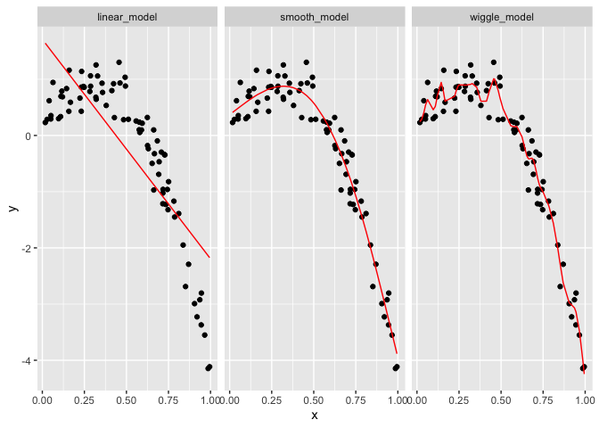
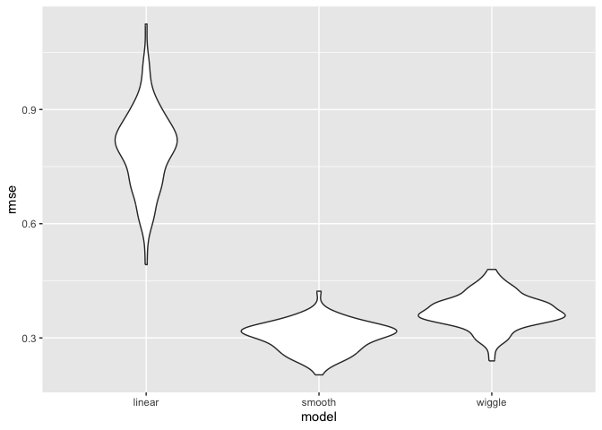
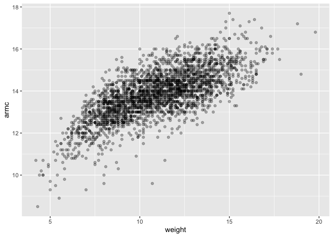
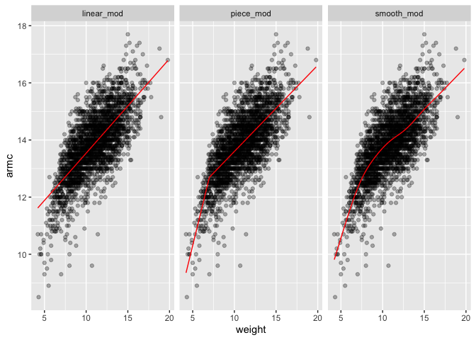
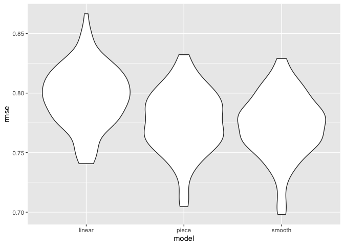

For many modern tools and in many applications, the emphasis lies on **prediction accuracy** rather than on statistical significance. In these cases, cross validation provides a way to compare the predictive performance of competing methods. 

In a basic case, you know what you need in your model and you're interested in one specific variable as a predictor to see if its important or not.

You have to figure out which model you want to use, based on the ones you can build. No model is 100% true. All we can do is approximate to a possible truth. 


```r
library(tidyverse)
library(modelr)
library(mgcv)
```

For nested models, you have tests. You have to worried about multiple comparisons and fishing. You add variables as you go, drop variables as you go...You have stats test you can use to find what is "significant".

When you have non-nested models, you don't get p-values for things that are not overlapping. How well do I fit the data using the residuals sum of squares? AND How much stuff has gone into my model? Goodness of fit AND complexity. 

Will my model generalize to future data? If so, then it's probably not under or overfitting, but doing a good job of predicting. 

### Prediction accuracy: 
-You build a couple of models based on X1 dataset 
-You get new data X2 from the same population 
-Apply the models to this dataset and see how accurate the predictions are. 

But we don't really do this in the real world. We just act like it does! So we do cross validation instead. 

### Cross validation:
- Randomly split your existing X1 data into 'training' and 'testing'. Ratio of this depends on sample size, but 80/20 is the standard.
- Training -> used to build model
- Testing -> data you collected you use to evaluate out-of-sample fit.
- Evaluate using RMSE: Root Mean Square Error 

### Refining and variations of cross validations
- Training/testing split is subject to randomness. If you repeat the split multiple times, you are able to see for yourself the variability in prediction accuracy. Helps you whether differences in the models are consistent across different splits.
- Multi-fold cross validation. 5-fold or 10-fold: divide data in 5 buckets. Uses 4 buckets to predict the 5th one and so on into equally sized subsets. 

Cross validation is very general and can be used to compare possible models of all kinds. Like 'modern' methods: 
- Automated variable selection
- Additive models
- Regression trees

### Prediction as goal
- Statistical significance definitely matters. But another way to generate evidence is through prediction accuracy. Even if your model shows statistical significance, it needs to be useful in predicting...or its not really describing the data generating mechanism well. 

-----------------------------

# CV by hand

We’ll start with a simulated example. The code chunk below generates data under a non-linear model; I like to use this setting because “model complexity” is easiest for me to understand when I can see it.

## Simulate the data 

```r
nonlinear_df = 
  tibble(
    id = 1:100,
    x = runif(100, 0, 1),
    y = 1 - 10 * (x - .3) ^ 2 + rnorm(100, 0, .3)
  )
```

## Look at the data on a graph
We can see that it is not a straight line. 

```r
nonlinear_df |> 
  ggplot(aes(x = x, y = y)) + 
  geom_point()
```

<!-- -->

Split this data into training and test sets (using anti_join!!) and replot showing the split. 

Our goal will be to use the training data (in black) to build candidate models, and then see how those models predict in the testing data (in red).


```r
train_df = sample_n(nonlinear_df, size=80) 
test_df = anti_join(nonlinear_df, train_df, by = "id")
#anti-join looks at rows that exist in non-linear df and not in my training df, the identifying column is ID.

ggplot(train_df, aes(x = x, y = y)) + 
  geom_point() + 
  geom_point(data = test_df, color = "red")
```

<!-- -->

## Fit 3 models.


```r
linear_model=lm(y~x, data=train_df) #lm is linear
smooth_model=gam(y~s(x), data=train_df) #generalized additive model (gam), y is a smooth function of x
wiggle_model=gam(y~s(x, k=30), sp=10e-6, data=train_df)
```
### Linear model


```r
train_df |>
  add_predictions(linear_model) |> 
  ggplot(aes(x=x, y=y)) + 
  geom_point() +
  geom_line(aes(y=pred), color="red")
```

<!-- -->

```r
#this linear model is throwing a line that doesnt really fit much
```

### Smooth model
Intuitively what may have best predictive accuracy.

```r
train_df |> 
  add_predictions(smooth_model) |> 
  ggplot(aes(x = x, y = y)) + geom_point() + 
  geom_line(aes(y = pred), color = "red")
```

<!-- -->

### Wiggle model
This model chases too much. Future data will not have the same outliers that make this wiggle model fit. 

```r
train_df |> 
  add_predictions(wiggle_model) |> 
  ggplot(aes(x = x, y = y)) + geom_point() + 
  geom_line(aes(y = pred), color = "red")
```

<!-- -->

In a case like this, I can also use the handy modelr::gather_predictions function – this is, essentially, a short way of adding predictions for several models to a data frame and then “pivoting” so the result is a tidy, “long” dataset that’s easily plottable.

```r
train_df |> 
  gather_predictions(linear_model, smooth_model, wiggle_model) |>
  mutate(model = fct_inorder(model)) |> 
  ggplot(aes(x = x, y = y)) + 
  geom_point() + 
  geom_line(aes(y = pred), color = "red") + 
  facet_wrap(~model)
```

<!-- -->

A quick visual inspection suggests that the linear model is too simple, the standard gam fit is pretty good, and the wiggly gam fit is too complex. Put differently, the linear model is too simple and, no matter what training data we use, will never capture the true relationship between variables – it will be consistently wrong due to its simplicity, and is therefore biased. The wiggly fit, on the other hand, is chasing data points and will change a lot from one training dataset to the the next – it will be consistently wrong due to its complexity, and is therefore highly variable. Both are bad!


## Now...let's look at prediction accuracy.

### Computing RMSE for each model

```r
rmse(linear_model, test_df)
```

```
## [1] 0.8549585
```

```r
rmse(smooth_model, test_df)
```

```
## [1] 0.3614918
```

```r
rmse(wiggle_model, test_df)
```

```
## [1] 0.3901695
```

[1] 0.8509912 - linear
[1] 0.3594032 - smooth
[1] 0.4281895 - wiggle

The RMSEs are suggestive that both nonlinear models work better than the linear model, and that the smooth fit is better than the wiggly fit. (The lower the RMSE, the better it fits). However, to get a sense of model stability we really need to iterate this whole process. Of course, this could be done using loops but that’s a hassle …

# CV using 'modelr'

'crossv_mc' preforms the training / testing split multiple times, AND stores the datasets using list columns.


```r
cv_df = #creating a cross validation df
  crossv_mc(nonlinear_df, 100)  #100 cross validation runs 
```

However, it’s not compatible with 'gam', so we have to convert each training and testing dataset (and lose that nice memory-saving stuff that 'crossv_mc' does in the process) using the code below. It’s worth noting, though, that if all the models you want to fit use 'lm, you can skip this.


```r
cv_df |> pull(train) |> nth(1) |> as_tibble() #looking at the first element of that list. this is a sample from OG dataset. missing ID 2! its in the test df.
```

```
## # A tibble: 79 × 3
##       id      x      y
##    <int>  <dbl>  <dbl>
##  1     1 0.355   0.930
##  2     2 0.233   0.871
##  3     3 0.787  -1.45 
##  4     4 0.287   0.875
##  5     5 0.779  -1.55 
##  6     6 0.380   0.534
##  7     7 0.0966  0.299
##  8     8 0.492   1.04 
##  9     9 0.0421  0.335
## 10    10 0.413   0.798
## # ℹ 69 more rows
```

```r
cv_df |> pull(test) |> nth(1) |> as_tibble()
```

```
## # A tibble: 21 × 3
##       id     x       y
##    <int> <dbl>   <dbl>
##  1    12 0.512  0.288 
##  2    15 0.630 -0.235 
##  3    16 0.203  0.933 
##  4    19 0.234  1.14  
##  5    26 0.579  0.0535
##  6    28 0.920 -3.23  
##  7    36 0.718 -0.959 
##  8    38 0.728 -0.346 
##  9    39 0.224  0.665 
## 10    45 0.837 -1.95  
## # ℹ 11 more rows
```

```r
cv_df =
  cv_df |> 
  mutate(
    train = map(train, as_tibble),
    test = map(test, as_tibble))
#this is creating a dataframe with the train and test obs
```

##Let's fit models and get RMSEs for them. 

I now have many training and testing datasets, and I’d like to fit my candidate models above and assess prediction accuracy as I did for the single training / testing split. To do this, I’ll fit models and obtain RMSEs using mutate + map & map2.

Is it possible for me to fit the linear model to every element in my training column?


```r
cv_df = 
  cv_df |> 
  mutate(
    linear_model  = map(.x = train, ~lm(y ~ x, data = .x)),
    smooth_model  = map(.x = train, ~gam(y ~ s(x), data = .x)),
    wiggle_model  = map(.x = train, ~gam(y ~ s(x, k = 30), sp = 10e-6, data = .x))) |>

# now we need to produce the RMSE that go along with them
  
  mutate(
    rmse_linear = map2_dbl(.x=linear_model, .y=test, ~rmse(model = .x, data = .y)),
    rmse_smooth = map2_dbl(.x=smooth_model, .y=test, ~rmse(model = .x, data = .y)),
    rmse_wiggle = map2_dbl(.x=wiggle_model, .y=test, ~rmse(model = .x, data = .y))
  )
```

(The .x takes the first training datasets and plugs it there so its mapping across every train dataset.)

##What do these results say about model choice?


```r
cv_df |> 
  select(starts_with("rmse")) |> 
  pivot_longer(
    everything(),
    names_to = "model", 
    values_to = "rmse",
    names_prefix = "rmse_") |> #gets rid of name prefix rmse
  mutate(model = fct_inorder(model)) |> 
  ggplot(aes(x = model, y = rmse)) + geom_violin()
```

<!-- -->

What you have is the dist of RMSE across a 100 training/testing splits fitting the linear model, smooth and wiggle models. 


```r
cv_df |> 
  select(starts_with("rmse")) |> 
  pivot_longer(
    everything(),
    names_to = "model", 
    values_to = "rmse",
    names_prefix = "rmse_") |>
  group_by(model) |>
  summarize(avg_rmse = mean(rmse))
```

```
## # A tibble: 3 × 2
##   model  avg_rmse
##   <chr>     <dbl>
## 1 linear    0.796
## 2 smooth    0.304
## 3 wiggle    0.370
```

# Child growth example

```r
child_growth = read_csv("./nepalese_children.csv")
```

```
## Rows: 2705 Columns: 5
## ── Column specification ────────────────────────────────────────────────────────
## Delimiter: ","
## dbl (5): age, sex, weight, height, armc
## 
## ℹ Use `spec()` to retrieve the full column specification for this data.
## ℹ Specify the column types or set `show_col_types = FALSE` to quiet this message.
```

```r
child_growth |> 
  ggplot(aes(x = weight, y = armc)) + 
  geom_point(alpha = .3)
```

<!-- -->

The plots suggests some non-linearity, especially at the low end of the weight distribution. We’ll try three models: a linear fit; a piecewise linear fit; and a smooth fit using gam. For the piecewise linear fit, we need to add a “change point term” to our dataframe. (Like additive models, for now it’s not critical that you understand everything about a piecewise linear fit – we’ll see a plot of the results soon, and the intuition from that is enough for our purposes.)

How well does weight predict arm circum? 


```r
child_growth =
  child_growth |> 
  mutate(
    weight_cp = (weight > 7) * (weight - 7))
```

Let's fit models. 


```r
linear_mod= lm(armc~weight, data=child_growth)
smooth_mod=gam(armc~s(weight), data=child_growth)
piece_mod=lm(armc~weight+weight_cp, data=child_growth)
```


```r
child_growth |>
  gather_predictions(linear_mod, smooth_mod, piece_mod) |>
  ggplot(aes(x=weight, y=armc))+
  geom_point(alpha=0.3) + geom_line(aes(y=pred), color="red") +
  facet_grid(.~model)
```

<!-- -->

".~model means everything against the model 

It’s not clear which is best – the linear model is maybe too simple, but the piecewise and non-linear models are pretty similar! Better check prediction errors using the same process as before – again, since I want to fit a gam model, I have to convert the resample objects produced by crossv_mc to dataframes, but wouldn’t have to do this if I only wanted to compare the linear and piecewise models.


```r
cv_df =
  crossv_mc(child_growth, 100) |> 
  mutate(
    train = map(train, as_tibble),
    test = map(test, as_tibble))
```


```r
cv_df = 
  cv_df |> 
  mutate(
    linear_mod  = map(.x=train, ~lm(armc ~ weight, data = .x)),
    piece_mod     = map(.x=train, ~lm(armc ~ weight + weight_cp, data = .x)),
    smooth_mod  = map(.x=train, ~gam(armc ~ s(weight), data =.x))
    ) |>
  mutate(
    rmse_linear = map2_dbl(.x=linear_mod, .y=test, ~rmse(model = .x, data = .y)),
    rmse_piece    = map2_dbl(.x=piece_mod, .y=test, ~rmse(model = .x, data = .y)),
    rmse_smooth = map2_dbl(.x=smooth_mod, .y=test, ~rmse(model = .x, data = .y))
  )
```


```r
cv_df |> 
  select(starts_with("rmse")) |> 
  pivot_longer(
    everything(),
    names_to = "model", 
    values_to = "rmse",
    names_prefix = "rmse_") |> 
  mutate(model = fct_inorder(model)) |> 
  ggplot(aes(x = model, y = rmse)) + geom_violin()
```

<!-- -->


Based on these results, there’s clearly some improvement in predictive accuracy gained by allowing non-linearity – whether this is sufficient to justify a more complex model isn’t obvious, though. Among the non-linear models, the smooth fit from gam might be a bit better than the piecewise linear model. Which candidate model is best, though, depends a bit on the need to balance complexity with goodness of fit and interpretability. 

In the end, I’d probably go with the *piecewise* linear model – the non-linearity is clear enough that it should be accounted for, and the differences between the piecewise and gam fits are small enough that the easy interpretation of the piecewise model “wins”.
"comparing the slopes of those 2 lines in the PW model is easier to interpret than the smooth line"
