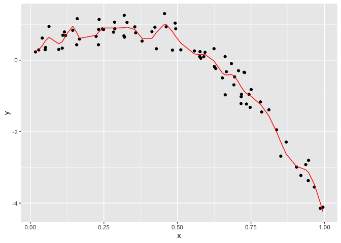

cross validation
================
Laura Robles-Torres
2023-11-30

For many modern tools and in many applications, the emphasis lies on
**prediction accuracy** rather than on statistical significance. In
these cases, cross validation provides a way to compare the predictive
performance of competing methods.

In a basic case, you know what you need in your model and you’re
interested in one specific variable as a predictor to see if its
important or not.

You have to figure out which model you want to use, based on the ones
you can build. No model is 100% true. All we can do is approximate to a
possible truth.

``` r
library(tidyverse)
library(modelr)
library(mgcv)
```

For nested models, you have tests. You have to worried about multiple
comparisons and fishing. You add variables as you go, drop variables as
you go…You have stats test you can use to find what is “significant”.

When you have non-nested models, you don’t get p-values for things that
are not overlapping. How well do I fit the data using the residuals sum
of squares? AND How much stuff has gone into my model? Goodness of fit
AND complexity.

Will my model generalize to future data? If so, then it’s probably not
under or overfitting, but doing a good job of predicting.

### Prediction accuracy:

-You build a couple of models based on X1 dataset -You get new data X2
from the same population -Apply the models to this dataset and see how
accurate the predictions are.

But we don’t really do this in the real world. We just act like it does!
So we do cross validation instead.

### Cross validation:

- Randomly split your existing X1 data into ‘training’ and ‘testing’.
  Ratio of this depends on sample size, but 80/20 is the standard.
- Training -\> used to build model
- Testing -\> data you collected you use to evaluate out-of-sample fit.
- Evaluate using RMSE: Root Mean Square Error

### Refining and variations of cross validations

- Training/testing split is subject to randomness. If you repeat the
  split multiple times, you are able to see for yourself the variability
  in prediction accuracy. Helps you whether differences in the models
  are consistent across different splits.
- Multi-fold cross validation. 5-fold or 10-fold: divide data in 5
  buckets. Uses 4 buckets to predict the 5th one and so on into equally
  sized subsets.

Cross validation is very general and can be used to compare possible
models of all kinds. Like ‘modern’ methods: - Automated variable
selection - Additive models - Regression trees

### Prediction as goal

- Statistical significance definitely matters. But another way to
  generate evidence is through prediction accuracy. Even if your model
  shows statistical significance, it needs to be useful in predicting…or
  its not really describing the data generating mechanism well.

------------------------------------------------------------------------

# CV by hand

We’ll start with a simulated example. The code chunk below generates
data under a non-linear model; I like to use this setting because “model
complexity” is easiest for me to understand when I can see it.

## Simulate the data

``` r
nonlinear_df = 
  tibble(
    id = 1:100,
    x = runif(100, 0, 1),
    y = 1 - 10 * (x - .3) ^ 2 + rnorm(100, 0, .3)
  )
```

## Look at the data on a graph

We can see that it is not a straight line.

``` r
nonlinear_df |> 
  ggplot(aes(x = x, y = y)) + 
  geom_point()
```

<!-- -->

Split this data into training and test sets (using anti_join!!) and
replot showing the split.

Our goal will be to use the training data (in black) to build candidate
models, and then see how those models predict in the testing data (in
red).

``` r
train_df = sample_n(nonlinear_df, size=80) 
test_df = anti_join(nonlinear_df, train_df, by = "id")
#anti-join looks at rows that exist in non-linear df and not in my training df, the identifying column is ID.

ggplot(train_df, aes(x = x, y = y)) + 
  geom_point() + 
  geom_point(data = test_df, color = "red")
```

<!-- -->

## Fit 3 models.

``` r
linear_model=lm(y~x, data=train_df) #lm is linear
smooth_model=gam(y~s(x), data=train_df) #generalized additive model (gam), y is a smooth function of x
wiggle_model=gam(y~s(x, k=30), sp=10e-6, data=train_df)
```

### Linear model

``` r
train_df |>
  add_predictions(linear_model) |> 
  ggplot(aes(x=x, y=y)) + 
  geom_point() +
  geom_line(aes(y=pred), color="red")
```

<!-- -->

``` r
#this linear model is throwing a line that doesnt really fit much
```

### Smooth model

``` r
train_df |> 
  add_predictions(smooth_model) |> 
  ggplot(aes(x = x, y = y)) + geom_point() + 
  geom_line(aes(y = pred), color = "red")
```

<!-- -->

### Wiggle model

``` r
train_df |> 
  add_predictions(wiggle_model) |> 
  ggplot(aes(x = x, y = y)) + geom_point() + 
  geom_line(aes(y = pred), color = "red")
```

<!-- -->
